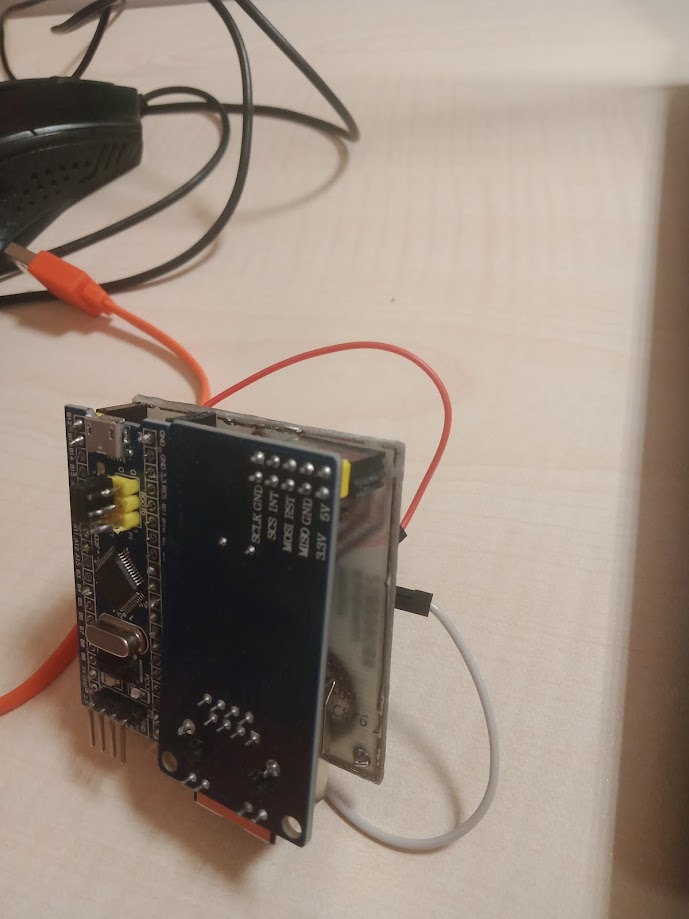

# MÜHTAS-1 IoT Cihazı
MÜHTAS-1, renk ve mesafe verilerini toplamak ve analiz etmek için tasarlanmış bir IoT (Internet of Things) cihazıdır. Bu cihaz STM32F103T8C6 MCU, TCS3200 renk sensörü, HC-SR04 uzaklık sensörü ve WIZnet 5500 Ethernet modülünü kullanır.

> Yukarıdaki iki fotoğrafta uzaklık sensörü bulunmamaktadır. Bunun sebebi 2023 güz döneminde bu sensörün projeye dahil olmamasıdır.
## Özellikler
* **STM32F103T8C6 MCU:** Bu mikrodenetleyici, tüm sensörler arasındaki iletişimi ve veri toplama işlemlerini yönetir.
* **TCS3200 Renk Sensörü:** Bu sensör, paketlerin renk bilgilerini toplar.
* **HC-SR04 Uzaklık Sensörü:** Bu sensör, paketlerin konveyör bandı üzerindeki konumunu belirler.
* **WIZnet 5500 Ethernet Modülü:** Bu modül, toplanan verileri UDP üzerinden web arayüzüne gönderir.

## Kullanılan Zamanlayıcılar
* **SPI1:** WIZnet 5500 Ethernet Modülü ile SPI haberleşmesi için kullanılır. APB2'ye bağlı olarak 72MHz hızında çalışır.
* **TIM1:** HC-SR04 Uzaklık Sensörü ile veri okumak için kullanılır. Prescaler 72-1 ve counter period 65535-1'de çalışır.
* **TIM3 CHA1:** TCS3200 Renk Sensörü ile veri okumak için kullanılır. Prescaler 0 ve counter period 65535'da çalışır.

## Nasıl Çalışır?
MÜHTAS-1'in temel işleyiş döngüsü aşağıda sunulmuştur:

1. Renk sensörüne sırasıyla kırmızı, mavi ve yeşil renkler ayarlanır ve her renk için frekans değeri okunur.
2. Uzaklık sensörü okuması yapılır.
3. Okunan renk ve uzaklık verileri bir JSON stringine dönüştürülür ve WIZnet modülüne gönderilir.
4. WIZnet modülü UDP protokolünü kullanarak bu veriyi ağa gönderir.
5. Döngü belirli bir gecikmeyle tekrar başlar.
